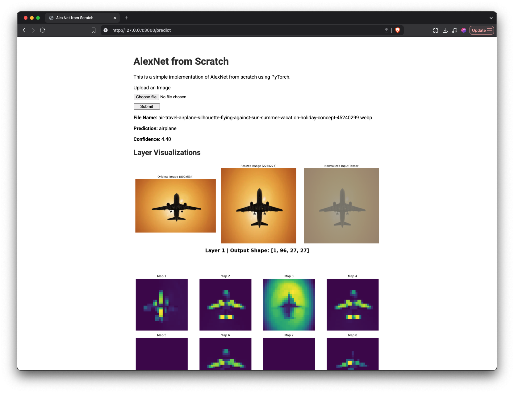
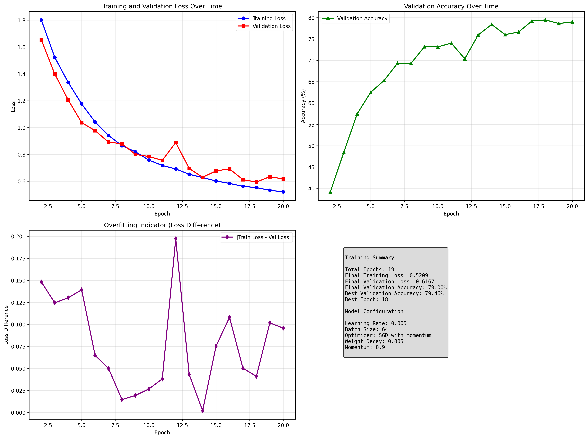

# AlexNet From Scratch



## Features

- Implementation of AlexNet in PyTorch.
- Training script for CIFAR-10 dataset.
- Inference script runs on img path.
- A simple web interface to upload images, get predictions and visualizations.
- Docker for easy usage.

## Getting Started

### Installation and Usage (Docker)

1.  **Clone the repository:**
    ```bash
    git clone https://github.com/KailashGanesh/AlexNet-From-Scratch.git
    cd AlexNet-From-Scratch
    ```
2.  **Build Image & Run Docker**
    ```bash
    docker build -t alexnet-app .
    docker run -p 3000:3000 alexnet-app
    ```
### Installation and Usage (Local)

1.  **Clone the repository:**
    ```bash
    git clone https://github.com/KailashGanesh/AlexNet-From-Scratch.git
    cd AlexNet-From-Scratch
    ```
2.  **Create a virtual environment and install dependencies:**
    ```bash
    python3 -m venv venv
    source venv/bin/activate
    pip install -r requirements.txt
    ```
4.  **Train the model:**

    if running on Mac with apple silicon use `PYTORCH_ENABLE_MPS_FALLBACK=1` since the original AlexNet implementation uses `nn.AdaptiveAvgPool2d` which is not supported on MPS backend.
    ```bash
    export PYTORCH_ENABLE_MPS_FALLBACK=1
    ```

    ```bash
    python train.py
    ```
    The training script will automatically download the CIFAR-10 dataset. The trained model will be saved in the `models/` directory.

5.  **Run the web server:**
    ```bash
    python server.py
    ```
    Open your browser and go to `http://127.0.0.1:3000` to use the web UI.

6.  **Run inference from the command line:**
    ```bash
    python inference.py <path_to_your_image>
    ```
## Training Summary



## References

- [AlexNet Paper](https://proceedings.neurips.cc/paper/2012/file/c399862d3b9d6b76c8436e924a68c45b-Paper.pdf)
- [Writing AlexNet from Scratch in PyTorch](https://www.digitalocean.com/community/tutorials/alexnet-pytorch)
- [Constructing Neural Networks from Scratch](https://www.digitalocean.com/community/tutorials/constructing-neural-networks-from-scratch)
- Main Inspiration: [The Moment we stopped understanding Ai [AlexNet]](https://youtu.be/UZDiGooFs54)
